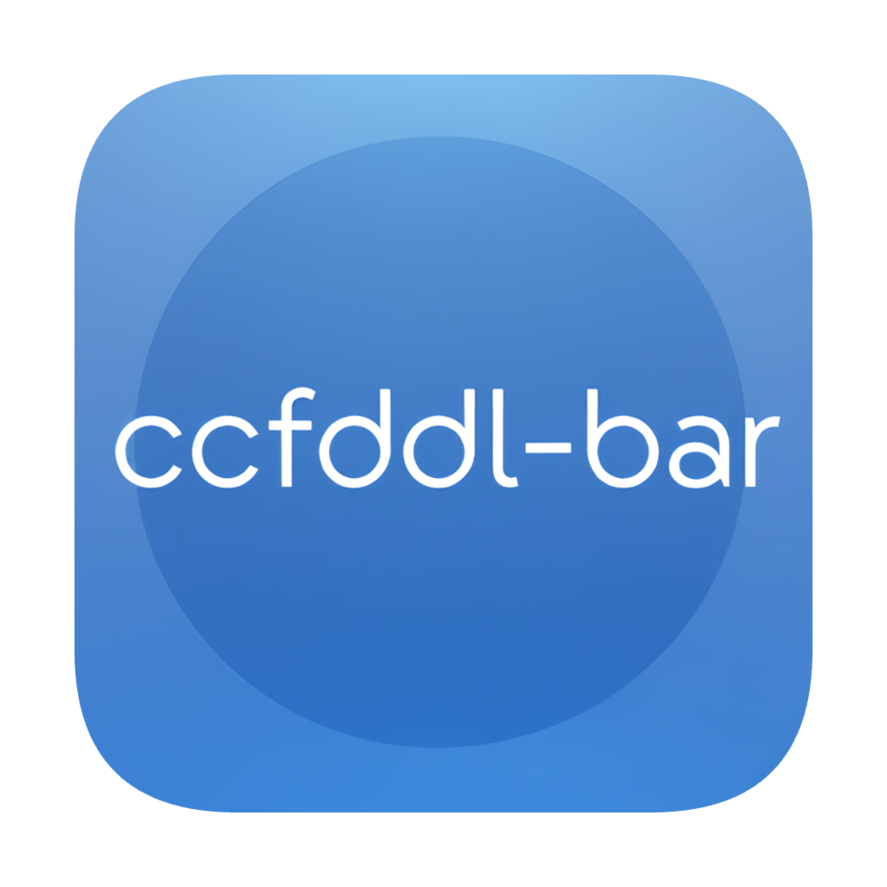
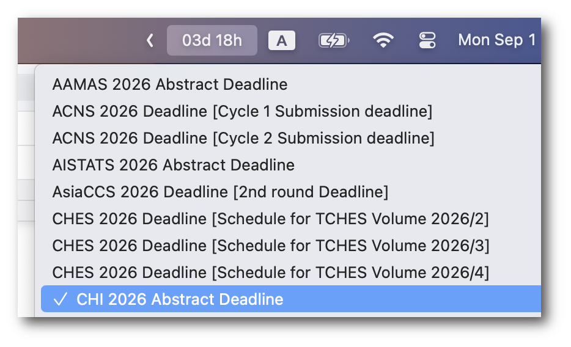

	

	

> This project is still under development and at the beta version by [liuup](https://github.com/liuup). Some features may not work as expected. -- Sep 1st 2025

# ccfddl-bar
🔥 Follow the worldwide conference countdown in real time on your MacBook status bar

👀 Highlights:
1. Real-time conference countdown with https://ccfddl.com/ from the local, without open the webpage
2. Swift native development, lightweight and unobtrusive status bar app
3. Auto-updating conference information

# Installation
1. Download the lastest version from [releases](https://github.com/liuup/ccfddl-bar/releases)
2. unzip the downloaded file
3. Double-click or drag the `ccfddl-bar.app` to your Applications folder

# Requirements
- macOS 13.5 (Ventura) or later
- An active internet connection

# TODO
- [ ] Add the Chinese README
- [ ] Modify the conferences list UI for better user experience
- [ ] Some conference deadlines may not be aligned with https://ccfddl.com/, fix the time resolver.

# You may also like
- [ccf-deadlines](https://github.com/ccfddl/ccf-deadlines), a web app for tracking CCF conferences deadlines.

# Disclaimer
1. This project is not affiliated with or endorsed by [CCF](https://www.ccf.org.cn/en/).
2. The logo of this project is generated by [Gemini 2.5 Flash Image](https://developers.googleblog.com/en/introducing-gemini-2-5-flash-image/) (aka nano-banana). Thanks Google😎.

# License
[MIT](./LICENSE)