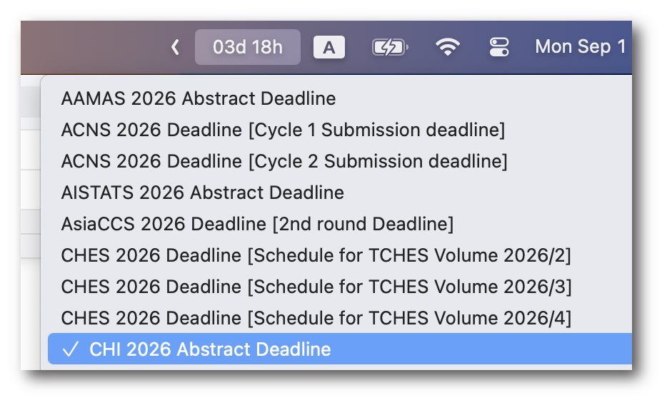

    

    

    <a href="./README.md">English</a> | <a href="./README_zh.md">中文</a>

> 本项目目前由 [liuup](https://github.com/liuup) 进行维护和开发，并处于测试阶段，某些功能可能无法按预期工作。-- 2025年9月1日

# ccfddl-bar
🔥 在 MacBook 状态栏上实时关注全球会议倒计时

👀 亮点:
1. 从本地实时获取 https://ccfddl.com/ 的会议倒计时，无需打开网页
2. Swift 原生开发，轻量级且不干扰的状态栏应用
3. 自动抓取并更新会议相关信息

# 安装
1. 从 [releases](https://github.com/liuup/ccfddl-bar/releases) 下载最新版本
2. 解压下载的文件
3. 双击或拖动 `ccfddl-bar.app` 到你的应用程序文件夹

# 系统要求
- macOS 13.5 (Ventura) 或更高版本
- 稳定的互联网连接

# TODO
- [x] 添加中文 README
- [ ] 修改会议列表 UI 以改善用户体验
- [ ] 某些会议截止日期可能与 https://ccfddl.com/ 不一致，修复时间解析器。

# 你可能还喜欢
- [ccf-deadlines](https://github.com/ccfddl/ccf-deadlines), 一个用于跟踪 CCF 会议截止日期的 Web 应用。

# 免责声明
1. 本项目与 [CCF](https://www.ccf.org.cn/en/) 没有任何关联或支持。
2. 本项目的 logo 由 [Gemini 2.5 Flash Image](https://developers.googleblog.com/en/introducing-gemini-2-5-flash-image/) (又名 nano-banana) 生成。感谢 Google😎。

# 许可证
[MIT](./LICENSE)